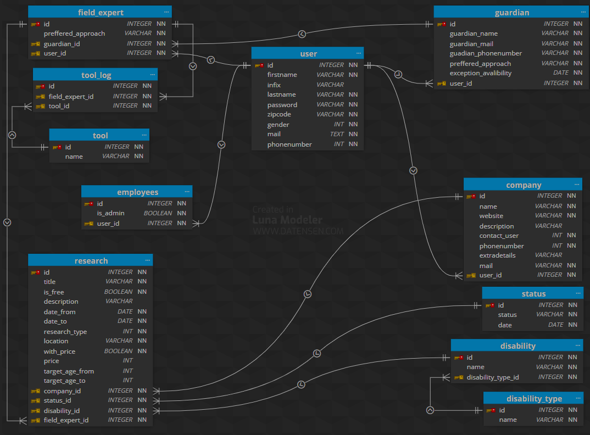

# wp3-2024-starter

in de terminal type de volgende commands om de app te gebruiken:
python -m venv .venv
.\.venv\Scripts\activate
pip install -r requirements.txt

voor het inloggen bestaan al admin en gebruiker accounts

admin
mail: john@example.com
wachtwoord: password123

gebruiker
mail: alice@example.com
wachtwoord: secret321

api routes:
/api/companies = lijst van alle organisaties
/api/companies/<company id> = specifieke organisatie

database ERD:

[text](<1A2 - Backlog items.csv>)

bronnen:

accessibility. accessibility logo. accessibility.nl. Geraadpleegd op 1 Februari 2024. https://www.accessibility.nl/

iconsdb. arrow 8 icon. iconsdb.com. Geraadpleegd op 1 Februari 2024. https://www.iconsdb.com/custom-color/arrow-8-icon.html

AlternateStd. Options icon. freepik.com. Geraadpleegd op 16 februari 2024. https://www.freepik.com/icon/options_2647907#fromView=search&term=nav&track=ais&page=1&position=7&uuid=92d328b5-14b4-4fef-9513-55ba9c8ccb88

WpZoom. red trashcan 10 icon. iconsdb.com. geraadpleegd op 20 februari 2024. https://www.iconsdb.com/red-icons/trash-10-icon.html

voor dit project is github copilot gebruikt
